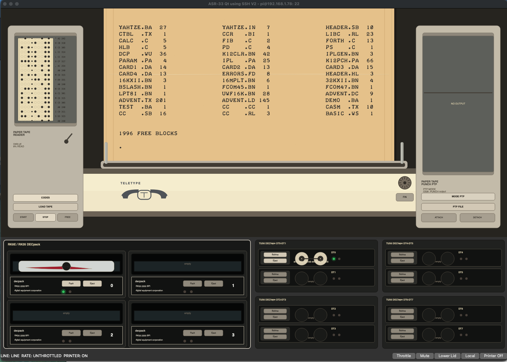

**ASR-33 PiDP-8 SSH Console**

Visual ASR-33 / DEC peripheral console for a PiDP-8/I running SIMH over SSH.

The project is now focused on one practical setup: a Mac or desktop computer runs this
PySide6 application, connects by SSH to the Raspberry Pi inside the PiDP-8/I, and
drives the already-running PiDP-8/SIMH session.

**Origin**

This project is derived from `progs-n-things/asr33emu`:

https://github.com/progs-n-things/asr33emu

The current fork keeps the ASR-33 terminal, paper tape, sound, and SSH foundations,
but narrows the application around a PiDP-8/I over SSH with a custom PySide6 visual
front panel.



**Scope**

This fork is intentionally narrow:

* entry point: `python ./asr33emu.py`
* main graphical frontend: Qt / PySide6
* backend: SSH via Paramiko
* terminal display painted as a Teletype-style paper feed
* paper tape reader and punch over SSH/SFTP
* RK05 and TU56 media selection for SIMH
* ASR-33 WAV sounds through the Pygame mixer
* no serial backend
* no Pygame frontend

Tkinter files may still exist in the repository, but the current visual work is in
`asr33_frontend_qt.py`.

**PiDP-8 Requirements**

Before starting the emulator:

* the PiDP-8/I Raspberry Pi must be powered on
* PiDP-8/SIMH must be installed and able to boot OS/8
* SSH must be enabled on the Raspberry Pi
* the Mac/desktop and the Raspberry Pi must be on the same network
* `asr33_config.yaml` must point to the Pi address and command
* the default PiDP-8 login is `pi`
* if password authentication is used, the Pi password must be stored in
  `.asr33_ssh_password`

Current expected SSH settings are under `backend.ssh_config`:

```yaml
backend:
  ssh_config:
    username: "pi"
    host: "192.168.1.78"
    port: 22
    command: "/opt/pidp8i/bin/pidp8i start >/dev/null 2>&1; exec /opt/pidp8i/bin/pidp8i"
```

Keep `username: "pi"` for a standard PiDP-8 installation. Change only `host` to the
actual IP address of your PiDP-8 on your network.

The app connects to that command over SSH. It is not a generic terminal emulator and
does not start a local PDP-8.

**Install**

Create and use a virtual environment:

```sh
python3 -m venv .venv
source .venv/bin/activate
python -m pip install --upgrade pip
python -m pip install PyYAML paramiko pillow fonttools pygame-ce PySide6
```

On macOS, Qt/PySide6 is provided by the Python package above. On Linux, make sure the
system has the usual Qt display dependencies installed.

**SSH Password**

The local password file `.asr33_ssh_password` is intentionally ignored by Git. If you
use password authentication, put only the Pi password in that file. The username
remains `pi` on a standard PiDP-8:

```sh
printf 'your-password\n' > .asr33_ssh_password
chmod 600 .asr33_ssh_password
```

SSH keys are also supported through the `backend.ssh_config` settings.

**Run**

```sh
source .venv/bin/activate
python ./asr33emu.py --frontend qt
```

The default configuration file is `asr33_config.yaml`. A different YAML file can be
selected with:

```sh
python ./asr33emu.py --config asr33_strict.yaml --frontend qt
```

**USB Media Layout On The Pi**

The interface expects removable USB media on the Raspberry Pi to be mounted under
`/media`.

Recommended layout:

```text
/media/PAPER_TAPE_PUNCH  paper tape reader/punch files: .pt, .tap, .rim, .bin, ...
/media/RK05        RK05 disk images: .rk05
/media/TU56        DECtape images: .tu56
```

If `/media/RK05` or `/media/TU56` is missing, the app falls back to the older SIMH
media locations:

* RK05 search order: `/media/RK05`, `os8`, `/opt/pidp8i/share/media`
* TU56 search order: `/media/TU56`, `/opt/pidp8i/share/media`, `os8`

The selected path is sent directly to SIMH, for example:

```text
attach rk0 "/media/RK05/v3d.rk05"
attach dt0 "/media/TU56/focal69.tu56"
```

**Paper Tape**

The paper tape reader lists compatible files from the configured remote directory,
currently `/media/PAPER_TAPE_PUNCH`, and loads them over SFTP.

The paper tape punch has two modes:

* raw ASR-33 punch captures the terminal stream exactly as it appears
* PTP mode attaches SIMH `ptp` to a remote file so OS/8 commands such as
  `.PUNCH DEMO.BA` create a clean paper tape file

For clean OS/8 output, use PTP mode rather than raw terminal capture.

**RK05**

The RK05 panel represents the RK8E controller:

```text
RK0  normally attached to os8/v3d.rk05 or /media/RK05/v3d.rk05
RK1  empty until a pack is selected
RK2  empty until a pack is selected
RK3  empty until a pack is selected
```

Click `Pack` on an RK unit to choose a `.rk05` image. Click `Eject` to detach it.
An attached unit shows a green lamp. Recent activity blinks red.

**TU56 DECtape**

The TU56 panels represent SIMH `dt` units:

```text
DT0-DT7  empty until a .tu56 image is selected
```

Click `Bobine` to choose a `.tu56` tape image. Click `Eject` to detach it. Attached
units show a green lamp. Recent activity blinks red.

**Terminal History**

The paper display can be scrolled with:

* mouse wheel
* dragging the paper
* Page Up / Page Down
* Home / End
* the `FIN` button to return to the latest printed line

**Troubleshooting**

If the app cannot connect:

* confirm the Pi responds to `ssh pi@192.168.1.78`
* confirm SSH is enabled on the Pi
* confirm both machines are on the same network
* confirm the configured Pi address is still correct
* confirm the SSH username is `pi` for a standard PiDP-8
* confirm PiDP-8/SIMH starts with `/opt/pidp8i/bin/pidp8i`
* confirm `.asr33_ssh_password` or SSH keys are available if authentication is needed

If RK05 or TU56 files do not appear:

* confirm the USB keys are mounted on the Pi
* confirm the directories are `/media/RK05` and `/media/TU56`
* confirm file extensions are `.rk05` and `.tu56`
* confirm the Pi user can read those files
